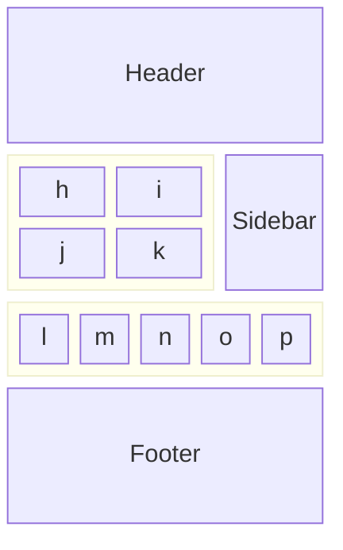
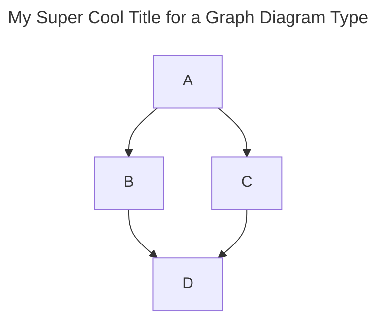

Hi there! You are reading this on my website created with a relatively new, 2021, technology, Astro, which is great for content rich websites like this personal blog.

import svgReference from "./images/image.svg";
import { Image } from "astro:assets";
import myImage from "./images/image1-1200x627.jpg";
import pagespeedImage from "./images/post-1/pagespeed-score.png";

## Table of contents

## The secret sauce

Astro is best-known for pioneering a new frontend architecture, Islands, to reduce JavaScript overhead and complexity compared to other frameworks.
The Island concept is the secret to Astro’s fast-by-default performance story!

An island is just a UI component on a static page of HTML that always renders in isolation. A page consists of multiple islands or components on the same page.

Islands allow Astro to automatically strip all unused JavaScript from your page, delivering faster performance without forcing you to give up your favorite UI components at dev time (React, Svelte, Vue, etc). In plain language, "You can use code to construct pages at build time. Then Astro strips the code out and ships plain HTML to your webserver."

The following diagram shows how a web pages can be assembled out of components.


The nice thing is that you can use any supported UI framework like react or vue to render your islands at build time. Astro will generate the HTML of those island components.  Astro will strip out all the JavaScript that is not needed thus keeping the pages small so that they download faster.

Should you need a client side component with JavaScript then you need is to specify with a "client:load" annotation and it will be retained and retained in the build.

```html
---
import MyButton from "../components/MyButton.jsx";
---

<html lang="en">
    <body>
        <MyButton client:load />
    </body>
</html>
```

## Content written in Markup

Web pages are typically structured as HTML, which is a text markup format that is great for web browsers, but somewhat more difficult for humans to use. Consequently Astro also enables one to write content in Markdown. Markdown is a markup language that has gained popularity among writers, developers, and content creators.  Markdown simplifies web content formatting, making it accessible and portable.

 1. Markdown simplifies formatting by providing an easy-to-use syntax. It’s suitable for creating websites, notes, presentations, documentation, and more.
 2. Markdown files can be opened in any text editor on any operating system.
 3. Markdown’s simplicity ensures that your content remains accessible even as technology evolves.

Astro support the use of MDX Markdown. This offers several benefits compared to traditional Markdown:

 * Interactivity: You can embed React components directly within your Markdown content, making it interactive and dynamic.
 * Reusability: MDX allows you to reuse the same components across different MDX files, improving consistency and maintainability.
 * Customizability: Create custom components to fit your project’s specific needs. You decide which component is rendered for each Markdown construct.
 * Maintainability: Keep documentation and code together, ensuring consistency and making it easier to manage.

In summary, Astro's support for MDX content combines the simplicity of Markdown with the power of JSX.

### Version Control

When content is written in simple text documents we can use same tools used by code developers to manage multiple versions. Version control of the content offers several benefits:

 * History and Revisions: Version control allows the author to track changes over time. You can review previous versions, compare changes, and revert to an earlier state if needed.
 * Backup and Safety: By using version control, your work is backed up in a repository. If your local copy is lost or corrupted, you can retrieve it from the repository.
 * Experimentation: Version control encourages experimentation. You can create branches to try out different ideas without affecting the main document.
 * Collaboration: Even as a single author, you might collaborate with others in the future. Version control prepares you for that possibility by providing a structured way to manage changes.

### Automated Builds

An automated workflow has been setup to automatically run when content changes are uploaded to the version control repository. This means that the author can focus on creating content not on the publication process which is now automatic.

## Open source

Astro is an opensource product. The benefits of this are:

 * Rapid Innovation: The collaborative nature of open source development fosters innovation. Communities contribute enhancements, features, and improvements at a faster pace.
 * Community Support: Open source communities offer forums, documentation, and support. Developers can share knowledge and collaborate with peers across organizations.
 * Flexibility and Customization: Open source software allows customization to fit specific needs. Developers can modify and extend the codebase, tailoring it to their requirements.
 * Cost Efficiency: Open source software is often free to use, and even when there’s a licensing fee, it’s typically much lower than proprietary alternatives.

## Community

The core Astro development team have not only built a great product that have nurtured a community around the product.  This community contribute help via [Discord](https://community.astro.build/).

### Preconfigured Themes

Since Astro can be configured to transform content in dozens of ways it is useful to start designing your website from a preconfigured [theme](https://astro.build/themes/).

This website is based on a theme called [Bookworm Light](https://astro.build/themes/details/bookworm-light-astro/). It is a minimal multi-author Astro blog theme that is perfect for any kind of blog website.

#### Performance

The theme is superfast. Slow site speed can result in poor search engine rankings, lower overall site traffic and negative user experiences.

https://pagespeed.web.dev/

<Image
  src={pagespeedImage}
  widths={[240, 540, 720, pagespeedImage.width]}
  sizes={`(max-width: 360px) 240px, (max-width: 720px) 540px, (max-width: 1600px) 720px, ${pagespeedImage.width}px`}
  alt="A description."
  title="This is a title"
/>

#### Theme features

Some of the important features of the [Bookworm Light](https://astro.build/themes/details/bookworm-light-astro/) theme are:

 * Fully responsive design for desktops, tablets, and smartphones
 * Great Google PageSpeed Score
 * Blog Post social share options
 * Tags and categories support for content
 * Search Functionality for content

#### Image optimisation

Performant websites require modern image formats, correct resizing methods, and lazy loading. Fortunately Astro has a package to take care of that for you as well. Here is an example from a Markdown file:

````md
import { Image } from "astro:assets";
import myImage from "./images/image1-1200x627.jpg";

<Image
  src={myImage}
  widths={[240, 540, 720, myImage.width]}
  sizes={`(max-width: 360px) 240px, (max-width: 720px) 540px, (max-width: 1600px) 720px, ${myImage.width}px`}
  alt="A description."
  title="This is a title"
/>

````
The snippet above creates multiple images in different sizes and generates the html necessary to ensure optimum website performance.

#### Text to Images with Mermaid

Mermaid is a utility that lets you define diagrams in a text-based, markdown-friendly way.
This, in turn, makes it easy to version-control these diagrams. The diagrams can be generated as SVG diagrams which is a text file.
Having images as text saves us from having to manage a separate image file.  It is also more performant for users to download the SVG rather than a bitmap image file.
Another big time saver is that you can specify types of images, with some basic data, which then means a lot of the heavy lifting of creating the image can be delegated to Mermaid.


````md

````
Becomes


#### SVG images

In addition to the automatically generated Mermaid diagrams, Astro, can also display SVG diagrams as the following markdown snippet shows.

````md
import svgReference from "./images/image.svg";


````


The benefit of this is that ability to embed arbitrarily complex custom-made images.

#### Search Engine Optimisation (SEO)

Getting SEO settings right for content websites used to be difficult.
By using an Astro component with a standard page layout and embedded logic makes it possible to generate information for many of the major SEO standards.
This for example ensures that when ever a link to an article is shared it is generated with a summary and catching image thumbnail.

#### Local Website keyword search

Once you get to a website it is often possible to use Google to scope search to a specific website domain but when content is frequently updated Google may not have indexed the new content yet.

[Bookworm Light](https://astro.build/themes/details/bookworm-light-astro/) has integrated in a local search capability based on [Fuse.js](https://www.fusejs.io/).

Fuse.js is suited for sites that require fuzzy searching when:

 * you want client-side fuzzy searching of small to moderately large data sets.
 * you can't justify setting up a dedicated backend simply to handle search. ElasticSearch or Algolia, although both great services, may be overkill for your particular use cases.

### Tags and Categories

Content can be labeled with categories and tags.  This enables me to group similar topics together.

## What's next for Astro

As an OpenSource popular project Astro has many contributors adding in new features on  a regular basis.  Two of the most interesting features that are being worked on at present are:

### Server Islands
*Server Islands*: extend the Island architecture primitive to deliver static pages that can be cached in Content Delivery Networks (CDN HTML page) shells but will then be injected dynamic content.

This improves:

*Performance:* Serve pages as static HTML, and cache aggressively.
*Personalization:* Serve pages as dynamic HTML, rendered on-demand. This forces your request through some data center that may be halfway around the world, which slows performance

Astro to skip rendering this component in the initial response and “defer” its render to later. This lets you cache the static page behind a CDN with some initial placeholder content.
When the dynamic HTML has loaded, it replaces the server island on the page with the HTML result of the deferred render.

### Content storage mechanism

Limitations of Content Collections in the current data structure is that it is stored entirely in memory.
This means that as the amount of content increases that cold-start times in serverless server side rendering (SSR) increases.
A new underlying storage mechanism for content in Astro is being experimented on. By embedding SQLite inside of Astro, we could scale up to millions of content entries in a project without breaking a sweat. Plus, SQLite’s file storage would dramatically speed up both development and build performance by allowing us to cache content across builds.

## Conclusion

Astro has quickly become a favorite in the development community. It is an all-in-one framework that works a lot like a static site generator.

Astro’s clear structure, simple syntax, and global components make building and running an application really easy. Building a static dramatically improves site responsiveness, and Astros capacity to work alongside other JavaScript frameworks also makes Astro appealing for more complex websites.

If your goal is to create a content-rich site that loads quickly, grants modular functionality, and provides both static generation, then Astro could be the right choice for you.
